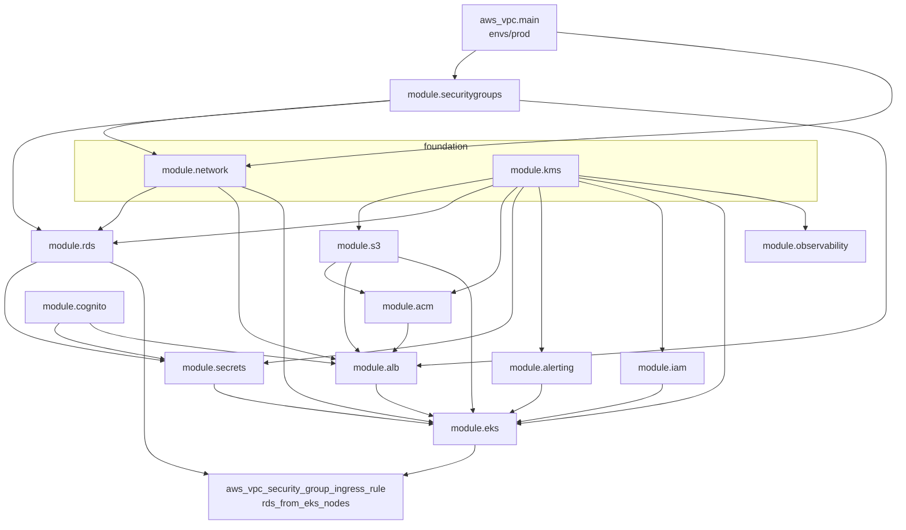
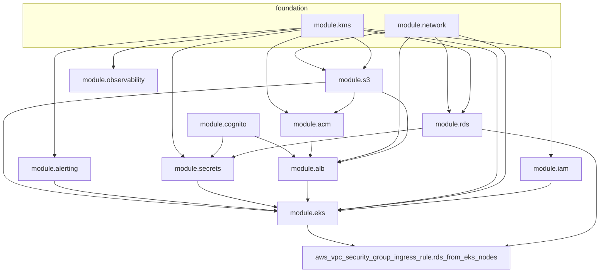

# Terraform layout & DevOps handoff — TEFCA Provider Identity Gateway (prod)

This document describes **everything under `infra/terraform/`**, how **`envs/prod`** composes modules, where AWS resources live conceptually, and the order in which pieces depend on each other. It is meant for engineers running plans, applies, and CI/CD.

---

## 1. Folder structure (what exists today)

```text
infra/terraform/
├── DEVOPS-TERRAFORM-HANDOFF.md   ← this file
├── modules/                      ← reusable building blocks (no provider block)
│   ├── acm/            ALB TLS cert + ALB trust store (S3-backed PEM bundle)
│   ├── alb/            Internet-facing ALB, listeners, target groups, WAF
│   ├── alerting/       SNS topic (+ optional email) for operational alerts
│   ├── cognito/        User pool + app client + hosted UI domain (admin SSO)
│   ├── eks/            EKS cluster (terraform-aws-modules), node group, IRSA roles
│   ├── iam/            ECR repository + GitHub OIDC deploy role (CI/CD permissions)
│   ├── kms/            One customer-managed KMS key (CMK) + alias
│   ├── network/        Subnets, routing, IGW, NAT instance (VPC lives in envs/prod)
│   ├── observability/  CloudWatch log group + sample ALB 5xx alarm
│   ├── rds/            PostgreSQL instance + subnet group
│   ├── s3/             Four buckets: audit, backup, alb-logs, trust-store
│   ├── secrets/        Secrets Manager (DB) + SSM parameters (HMAC, JWT, Cognito)
│   └── securitygroups.tf/  ALL security groups: NAT, ALB, RDS
└── envs/
    └── prod/                     ← **only** live prod "stack" composition
        ├── main.tf               wires all modules + aws_vpc + VPC flow logs
        ├── variables.tf          root input variables
        ├── outputs.tf            values for humans / CI / runbooks
        ├── backend.tf            S3 backend schema (values via backend.hcl)
        ├── backend.hcl           generated by bootstrap (not committed)
        └── terraform.tfvars.example

infra/eks/                        ← Helm add-ons Terraform layer (separate state)
    ├── main.tf                   providers, remote state read, kubeconfig update
    ├── variables.tf              fallback variables
    ├── alb-controller.tf         AWS Load Balancer Controller helm_release
    └── external-secrets.tf       External Secrets Operator helm_release
```

**Important:** `modules/*` are **library** definitions. **Nothing is deployed** until you run Terraform from **`envs/prod`** (or `infra/eks/` for the add-ons layer).

---

## 2. How `envs/prod` relates to `modules/`

| Concept | Path | Role |
|--------|------|------|
| **Root module** (what you `terraform apply`) | `infra/terraform/envs/prod/` | Declares `provider`, `terraform {}`, `module "…" {}` blocks, **`aws_vpc`**, VPC flow logs, and any **root-only** resources. |
| **Child modules** | `infra/terraform/modules/<name>/` | Encapsulate one concern; referenced via `source = "../../modules/<name>"` from prod. |
| **Add-ons layer** | `infra/eks/` | Separate Terraform root applied **after** the EKS cluster exists. Installs LBC + ESO via Helm. |

From `envs/prod`, relative paths resolve as:

- `source = "../../modules/network"` → `infra/terraform/modules/network`

**Naming convention in prod:** most modules receive a logical name of **`"${var.name_prefix}-prod"`**. With default `var.name_prefix = "tefca-gw"`, that is **`tefca-gw-prod`**. **Change `name_prefix` in `terraform.tfvars` only with care** — it renames many resources.

---

## 3. Step-by-step: how to run prod Terraform

### 3a. Infra layer (`envs/prod`)

1. **One-time state backend** (outside this folder): run `infra/bootstrap.sh` so S3 + DynamoDB lock exist; it writes `envs/prod/backend.hcl`. See `infra/README.md`.
2. **Copy variables:** `cp terraform.tfvars.example terraform.tfvars` and edit domains, GitHub org/repo, partner CAs, etc.
3. **Export sensitive bootstrap var** (first apply only): `export TF_VAR_hmac_secret_initial=…`
4. **From `infra/terraform/envs/prod`:**
   ```bash
   terraform init -backend-config=backend.hcl
   terraform plan -out=tfplan
   terraform apply tfplan
   ```

### 3b. Add-ons layer (`infra/eks`)

After the EKS cluster exists, apply the add-ons Terraform layer:

```bash
cd infra/eks/
terraform init
terraform plan -out=tfplan
terraform apply tfplan
```

This installs AWS Load Balancer Controller v1.7.1 and External Secrets Operator v0.9.19 via Helm. Values are read automatically from the `envs/prod` remote state.

---

## 4. Key architectural decisions

### 4.1 VPC owned by `envs/prod`, not `modules/network`

`aws_vpc`, VPC flow logs, flow-log IAM role/policy, and `aws_flow_log` are declared directly in **`envs/prod/main.tf`**. The `modules/network` and `modules/securitygroups.tf` modules both receive `vpc_id` as an input. This breaks what would otherwise be a Terraform module-reference cycle:

```
modules/securitygroups.tf  needs vpc_id  (from envs/prod → aws_vpc.main)
modules/network            needs nat_sg_id (from modules/securitygroups.tf)
```

Without this split, the two modules would mutually depend on each other.

### 4.2 All security groups in `modules/securitygroups.tf`

All three application-tier SGs (NAT, ALB, RDS) live in `modules/securitygroups.tf/main.tf`. No other module creates a security group. This satisfies the infra-guidelines requirement and means:

- `modules/alb` accepts `alb_sg_id` as input
- `modules/rds` accepts `rds_sg_id` as input
- `modules/network` accepts `nat_sg_id` as input
- The RDS-from-EKS rule is a root-level `aws_vpc_security_group_ingress_rule` (to avoid a module cycle with EKS)

### 4.3 No VPC endpoints — NAT instance only

All private-subnet traffic to AWS APIs (ECR, Secrets Manager, SSM, Logs, KMS) routes through a **single `t4g.nano` NAT instance** (fck-nat ARM AMI). Managed NAT Gateway and all interface/gateway VPC endpoints have been removed. Cost impact: ~$3/mo vs ~$32/mo for a managed NAT GW.

### 4.4 GitHub OIDC provider pre-exists in the AWS account

The OIDC provider for `token.actions.githubusercontent.com` is already registered in the account. `modules/iam` uses a **`data "aws_iam_openid_connect_provider"`** lookup instead of creating it, avoiding a conflict on re-apply.

---

## 5. Dependency graph (high level)



**Special case — RDS ↔ EKS:** `module.rds` is called with **`allowed_sg_ids = []`** — the RDS module does **not** embed inline ingress rules for EKS. Instead, **`aws_vpc_security_group_ingress_rule.rds_from_eks_nodes`** in `envs/prod/main.tf` allows Postgres from the EKS node security group after `module.eks` exists.

---

## 6. Root module (`envs/prod`) — what is defined only here

| Item | File | Purpose |
|------|------|---------|
| `terraform` / `provider "aws"` | `main.tf` | Required providers (`aws`, `tls`, `random`), AWS region, **default tags** on all taggable resources. |
| `aws_vpc.main` | `main.tf` | VPC definition (HIPAA — DNS hostnames + support enabled). |
| `aws_cloudwatch_log_group.vpc_flow` + IAM + `aws_flow_log.main` | `main.tf` | VPC flow logs (all traffic, 14-day retention, KMS-encrypted). |
| `locals.cluster_name` / `locals.vpc_name` | `main.tf` | EKS cluster name and VPC name = `"${var.name_prefix}-prod"`. |
| `module "…"` blocks | `main.tf` | Composition (see §7). |
| `aws_vpc_security_group_ingress_rule.rds_from_eks_nodes` | `main.tf` | **Postgres 5432** from `module.eks.node_security_group_id` → `module.rds.security_group_id`. |
| `variable` declarations | `variables.tf` | Inputs for prod (domains, GitHub, secrets bootstrap, VPC CIDR, sizing, etc.). |
| `output` declarations | `outputs.tf` | URLs, ARNs, cluster name, IRSA ARNs, VPC id, subnet ids, etc. |
| Backend config | `backend.tf` + `backend.hcl` | Remote state in **S3** (`chit-terraform-state-sydata`). |

---

## 7. Module-by-module: paths, main resources, and how prod wires them

### 7.1 `modules/securitygroups.tf` → `module "securitygroups"` *(new)*

**Purpose:** Single place for **all** application-tier security groups per infra-guidelines.

**Primary resources:**

| Resource | Description |
|----------|-------------|
| `aws_security_group.nat` | Allows all egress + inbound from `vpc_cidr`; attached to NAT instance |
| `aws_security_group.alb` | Opens `:443` and `:8444` to `0.0.0.0/0` |
| `aws_security_group.rds` | Dynamic ingress from `allowed_rds_sg_ids` (RDS-from-EKS rule added separately in prod) |

**Prod passes:** `name_prefix`, `vpc_id = aws_vpc.main.id`, `vpc_cidr`, `allowed_rds_sg_ids = []`.

**Outputs wired:** `nat_sg_id` → **network**; `alb_sg_id` → **alb** + **eks**; `rds_sg_id` → **rds**.

---

### 7.2 `modules/network` → `module "network"`

**Purpose:** Subnets, routing, IGW, and NAT instance on top of the VPC created in `envs/prod`.

**Primary resources:**

| Resource type | Notes |
|---------------|-------|
| `aws_subnet` (public × AZ, private × AZ) | CIDRs derived from `vpc_cidr` via `cidrsubnet()` |
| `aws_internet_gateway`, route tables, associations | Public internet path |
| `aws_instance` (NAT) | Optional ARM `t4g.nano` fck-nat instance — ~$3/mo |

VPC, flow logs, and all VPC endpoints have been removed from this module (see §4.1 and §4.3).

**Prod passes:** `name`, `vpc_id = aws_vpc.main.id`, `vpc_cidr`, `availability_zones`, `nat_sg_id = module.securitygroups.nat_sg_id`, `enable_nat_instance`, `nat_instance_type`, `eks_cluster_name`.

**Outputs consumed elsewhere:** `vpc_id` (passthrough), `public_subnet_ids`, `private_subnet_ids`, `nat_instance_id`.

---

### 7.3 `modules/kms` → `module "kms"`

**Purpose:** One **customer-managed CMK** shared by RDS, S3 (non–ALB-log buckets), Secrets Manager, SSM SecureStrings, CloudWatch log groups, SNS, etc.

**Primary resources:** `aws_kms_key`, `aws_kms_alias`.

**Prod passes:** `name = "${var.name_prefix}-prod"`.

**Outputs:** `cmk_arn` → almost every other module that encrypts data.

---

### 7.4 `modules/s3` → `module "s3"`

**Purpose:** Four buckets:

| Key | Bucket name pattern | Role |
|-----|---------------------|------|
| `audit` | `{name_prefix}-audit` | **Object Lock COMPLIANCE** 6yr, KMS, Glacier lifecycle |
| `backup` | `{name_prefix}-backup` | Encrypted backups |
| `alb_logs` | `{name_prefix}-alb-logs` | ALB access logs (SSE-S3) |
| `trust_store` | `{name_prefix}-trust-store` | PEM objects for ALB mTLS trust store |

**Prod passes:** `name_prefix`, `kms_key_arn`, `audit_retention_yrs = 6`.

---

### 7.5 `modules/acm` → `module "acm"`

**Purpose:** ALB TLS: ACM DNS-validated cert or bootstrap self-signed cert + ALB trust store from partner CA PEMs in S3.

**Prod passes:** `name`, `domain_name = var.gateway_domain`, `trust_store_bucket`, `partner_cas`, `use_self_signed_server_cert`.

**Outputs wired:** `server_cert_arn`, `trust_store_arn` → **alb**.

---

### 7.6 `modules/rds` → `module "rds"`

**Purpose:** Single PostgreSQL instance (`db.t4g.micro` default), KMS-encrypted, in private subnets, with RDS SG from `modules/securitygroups.tf`.

**Prod passes:** `name`, `vpc_id`, `subnet_ids = private_subnet_ids`, `rds_sg_id = module.securitygroups.rds_sg_id`, `kms_key_arn`, `allowed_sg_ids = []`.

**Outputs wired:** `username`, `password`, `endpoint`, `db_name`, `security_group_id` → **secrets** + root SG rule.

---

### 7.7 `modules/secrets` → `module "secrets"`

**Purpose:** Secrets Manager secret for DB JSON + SSM parameters for HMAC, JWT, Cognito app client secret.

**Prod passes:** `name_prefix`, `kms_key_arn`, RDS fields, `hmac_secret` (from `TF_VAR`), JWT vars, `cognito_client_secret`.

**Outputs wired:** `all_arns` → **eks** IRSA policies.

---

### 7.8 `modules/cognito` → `module "cognito"`

**Purpose:** Cognito User Pool with MFA, app client, hosted UI domain for admin OAuth2.

**Prod passes:** `name = "${var.name_prefix}-prod-admin"`, callback/logout URLs from `var.admin_domain`.

**Outputs wired:** `user_pool_arn`, `client_id`, `domain`, `issuer_uri`, `client_secret` → **alb** + **secrets**.

---

### 7.9 `modules/alb` → `module "alb"`

**Purpose:** Internet-facing ALB with `:443` mTLS → gateway target group, `:8444` HTTPS → admin target group, access logging, optional WAFv2.

**Prod passes:** `name`, `vpc_id`, `public_subnet_ids`, `alb_sg_id = module.securitygroups.alb_sg_id`, ACM cert + trust store ARNs, `access_logs_bucket`, Cognito identifiers, domains, `enable_waf`.

**Outputs wired:** `alb_sg_id`, `gateway_target_group_arn`, `admin_target_group_arn` → **eks** / CI.

---

### 7.10 `modules/alerting` → `module "alerting"`

**Purpose:** KMS-encrypted SNS topic for certificate-expiry and operational alarms; optional email subscription.

**Prod passes:** `name_prefix`, `kms_key_arn`, `alert_email`.

**Outputs wired:** `topic_arn` → **eks**.

---

### 7.11 `modules/iam` → `module "iam"`

**Purpose:** ECR repository + GitHub OIDC **deploy role** with full CI/CD pipeline permissions.

**GitHub OIDC:** The OIDC provider (`token.actions.githubusercontent.com`) is **already registered** in the AWS account. The module uses a `data` lookup instead of creating it — no conflict on apply.

**Deploy role trust:** Scoped to `repo:<org>/<repo>:ref:refs/heads/<branch>` and `environment:prod` only. `pull_request` is intentionally excluded.

**Deploy role permissions (grouped):**

| Group | Actions |
|-------|---------|
| ECR push | `GetAuthorizationToken`, `BatchCheckLayerAvailability`, `PutImage`, etc. (scoped to repo ARN) |
| EKS deploy | `DescribeCluster`, `ListClusters`, `DescribeAccessEntry`, `ListAccessEntries` |
| ALB / TG | `DescribeTargetGroups`, `DescribeTargetHealth`, `DescribeLoadBalancers`, `DescribeListeners` |
| Terraform state | `s3:GetObject`, `PutObject`, `DeleteObject`, `ListBucket` on `var.tfstate_bucket` |
| Secrets Manager | `GetSecretValue`, `DescribeSecret` on `${name_prefix}/*` |
| SSM | `GetParameter`, `GetParameters`, `GetParametersByPath` on JWT param path |
| KMS | `Decrypt`, `GenerateDataKey`, `DescribeKey` on the shared CMK |
| Cognito | Read-only (`ListUserPools`, `DescribeUserPool`, `DescribeUserPoolClient`) |
| IAM introspection | `GetRole` on gateway pod IRSA role |
| SNS / S3 list | `ListTopics`, `ListAllMyBuckets` |

**Prod passes:** `name_prefix`, `kms_cmk_arn`, `github_org`, `github_repo`, `github_branch`, `eks_cluster_name`, `tfstate_bucket`.

**Outputs wired:** `github_deploy_role_arn` → **eks** access entry; root output for CI secret.

---

### 7.12 `modules/eks` → `module "eks"`

**Purpose:** EKS control plane + Graviton managed node group, KMS envelope encryption, GitHub deploy role access entry, extra node SG rule (ALB → :8080), and IRSA roles for LBC / External Secrets / gateway pod.

**Prod passes:** `cluster_name`, `cluster_version`, `aws_region`, `vpc_id`, `private_subnet_ids`, `alb_security_group_id = module.securitygroups.alb_sg_id`, `github_deploy_role_arn`, `kms_key_arn`, S3/KMS/secret ARNs, `alerts_topic_arn`.

**Post-Terraform:** Apply `infra/eks/` Terraform layer to install Helm add-ons.

---

### 7.13 `modules/observability` → `module "observability"`

**Purpose:** CloudWatch Log Group for application logs + starter ALB 5xx alarm.

**Prod passes:** `name_prefix`, `kms_key_arn`, `log_retention_days`.

---

## 8. Root outputs (`envs/prod/outputs.tf`)

| Output | Typical use |
|--------|-------------|
| `gateway_url`, `admin_url` | DNS / UAT bookmarks |
| `alb_dns_name` | CNAME until custom domains point at ALB |
| `ecr_repository_url` | CI image push target |
| `audit_bucket` | S3 audit bucket name |
| `rds_endpoint` | JDBC / debugging |
| `kms_cmk_arn` | Key rotation / break-glass audits |
| `eks_cluster_name`, `eks_cluster_endpoint` | `kubectl`, `aws eks update-kubeconfig` |
| `eks_oidc_provider_arn` | IRSA troubleshooting |
| `eks_irsa_lbc_role_arn` | Helm values for LBC service account annotation |
| `eks_irsa_external_secrets_role_arn` | Helm values for ESO service account annotation |
| `eks_irsa_gateway_pod_role_arn` | Kubernetes service account annotation for app pods |
| `eks_node_security_group_id` | Network troubleshooting |
| `vpc_id` | `infra/eks/` add-ons layer, peering, firewall tickets |
| `vpc_cidr` | Security group / ACL reference |
| `public_subnet_ids` | ALB placement verification |
| `private_subnet_ids` | EKS/RDS placement verification |

---

## 9. Outside Terraform but part of "the platform"

| Path | Role |
|------|------|
| `infra/bootstrap.sh` | Creates remote state S3 bucket + DynamoDB lock; writes `backend.hcl`. |
| `infra/eks/` | **Terraform** layer — installs AWS Load Balancer Controller (v1.7.1) + External Secrets Operator (v0.9.19) via Helm. Reads outputs from `envs/prod` remote state automatically. Run `terraform apply` here after the EKS cluster first exists. |
| `infra/k8s/*.yaml` | Namespace, IRSA `ServiceAccount`, `ClusterSecretStore`, `ExternalSecret`, `Deployment`, `Service`, `TargetGroupBinding`. |
| `.github/workflows/deploy.yml` | Build/push ARM image to ECR; `kubectl` apply / rollout to EKS. Assumes the `AWS_DEPLOY_ROLE_ARN` secret is set to `terraform output github_deploy_role_arn`. |

---

## 10. Checklist before handoff sign-off

- [ ] `terraform.tfvars` filled with real `gateway_domain`, `admin_domain`, `github_org` / `github_repo`.
- [ ] `TF_VAR_hmac_secret_initial` supplied on first apply only; rotate via SSM afterwards.
- [ ] `backend.hcl` present after bootstrap; `terraform init -backend-config=backend.hcl` succeeds.
- [ ] `trusted_partner_cas` populated before expecting mTLS partner traffic (or bootstrap mode understood).
- [ ] GitHub Actions secret `AWS_DEPLOY_ROLE_ARN` set to value of `terraform output github_deploy_role_arn`.
- [ ] GitHub OIDC provider already registered in AWS account — `modules/iam` uses a `data` source, no re-creation needed.
- [ ] After first successful `envs/prod` apply: `cd infra/eks/ && terraform apply` to install LBC + ESO.
- [ ] Confirm `infra/eks/` remote state key (`Provider-Identity-gateway/eks/addons/terraform.tfstate`) does not conflict with any existing state.
- [ ] Target group names in CI (`{name_prefix}-gw` / `-admin`) match ALB module naming.

---

## 11. Questions for your team

1. **Region:** Is prod always `us-east-1`, or do you need a parameterised second region?
2. **`name_prefix`:** Will you ever run multiple prod-like stacks in one account (naming collision risk)?
3. **Logs:** Do you require Container Insights / Fluent Bit shipping to the existing CW log group, or is stdout-only on nodes acceptable for now?
4. **NAT HA:** The current setup uses a single NAT instance (`t4g.nano`). If you need higher availability, set `enable_nat_instance = false` and provision a managed NAT Gateway externally.

---

*Updated to reflect the current architecture: VPC lifted to `envs/prod`, all SGs consolidated in `modules/securitygroups.tf`, VPC endpoints removed, `infra/eks/` converted to Terraform, GitHub OIDC provider referenced via data source, and full CI/CD IAM permissions documented.*


This document describes **everything under `infra/terraform/`**, how **`envs/prod`** composes modules, where AWS resources live conceptually, and the order in which pieces depend on each other. It is meant for engineers running plans, applies, and CI/CD.

---

## 1. Folder structure (what exists today)

```text
infra/terraform/
├── DEVOPS-TERRAFORM-HANDOFF.md   ← this file
├── modules/                      ← reusable building blocks (no provider block)
│   ├── acm/          ALB TLS cert + ALB trust store (S3-backed PEM bundle)
│   ├── alb/          Internet-facing ALB, listeners, target groups, WAF
│   ├── alerting/   SNS topic (+ optional email) for operational alerts
│   ├── cognito/    User pool + app client + hosted UI domain (admin SSO)
│   ├── eks/        EKS cluster (terraform-aws-modules), node group, IRSA roles
│   ├── iam/        ECR repository + GitHub OIDC deploy role
│   ├── kms/        One customer-managed KMS key (CMK) + alias
│   ├── network/    VPC, subnets, NAT, flow logs, VPC endpoints
│   ├── observability/ CloudWatch log group + sample ALB 5xx alarm
│   ├── rds/        PostgreSQL instance + subnet group + SG
│   ├── s3/         Four buckets: audit, backup, alb-logs, trust-store
│   └── secrets/    Secrets Manager (DB) + SSM parameters (HMAC, JWT, Cognito)
└── envs/
    └── prod/                     ← **only** live prod “stack” composition
        ├── main.tf               wires all modules + one extra SG rule
        ├── variables.tf          root input variables
        ├── outputs.tf            values for humans / CI / runbooks
        ├── backend.tf            S3 backend *schema* (values via backend.hcl)
        ├── backend.hcl           generated by bootstrap (not committed secrets)
        └── terraform.tfvars.example
```

**Important:** `modules/*` are **library** definitions. **Nothing is deployed** until you run Terraform from **`envs/prod`** (or another env folder you add later).

---

## 2. How `envs/prod` relates to `modules/`

| Concept | Path | Role |
|--------|------|------|
| **Root module** (what you `terraform apply`) | `infra/terraform/envs/prod/` | Declares `provider`, `terraform {}`, `module "…" {}` blocks, and any **root-only** resources. |
| **Child modules** | `infra/terraform/modules/<name>/` | Encapsulate one concern; referenced via `source = "../../modules/<name>"` from prod. |

From `envs/prod`, relative paths resolve as:

- `source = "../../modules/network"` → `infra/terraform/modules/network`

**Naming convention in prod:** most modules receive a logical name of **`"${var.name_prefix}-prod"`**. With default `var.name_prefix = "tefca-gw"`, that is **`tefca-gw-prod`** (cluster, buckets, RDS identifier, Cognito pool name pattern, etc.). **Change `name_prefix` in `terraform.tfvars` only with care** — it renames many resources.

---

## 3. Step-by-step: how to run prod Terraform

1. **One-time state backend** (outside this folder but required): run `infra/bootstrap.sh` so S3 + DynamoDB lock exist; it writes `envs/prod/backend.hcl`. See `infra/README.md`.
2. **Copy variables:** `cp terraform.tfvars.example terraform.tfvars` and edit domains, GitHub org/repo, partner CAs, etc.
3. **Export sensitive bootstrap var** (first apply only): `export TF_VAR_hmac_secret_initial=…`
4. **From `infra/terraform/envs/prod`:**
   ```bash
   terraform init -backend-config=backend.hcl
   terraform plan -out=tfplan
   terraform apply tfplan
   ```
5. **Kubernetes (not Terraform):** after the cluster exists, run `infra/eks/install-addons.sh` once with outputs from `terraform output`, then CI applies `infra/k8s/*` (see `infra/README.md`).

---

## 4. Dependency graph (high level)

Terraform builds a DAG from `module` arguments. **File order in `main.tf` does not imply apply order.**



**Special case — RDS ↔ EKS:** `module.rds` is called with **`allowed_sg_ids = []`** so the RDS module does **not** embed inline “from ECS task SG” rules (that would create a Terraform cycle with EKS). Instead, **`aws_vpc_security_group_ingress_rule.rds_from_eks_nodes`** in `envs/prod/main.tf` allows **Postgres from the EKS node security group** after `module.eks` exists.

---

## 5. Root module (`envs/prod`) — what is defined only here

| Item | File | Purpose |
|------|------|---------|
| `terraform` / `provider "aws"` | `main.tf` | Required providers (`aws`, `tls`, `random`), AWS region, **default tags** on all taggable resources. |
| `locals.cluster_name` | `main.tf` | EKS cluster name = `"${var.name_prefix}-prod"` (must stay aligned with GitHub `deploy.yml` / `infra/k8s` if you rename). |
| `module "…"` blocks | `main.tf` | Composition (see §6). |
| `aws_vpc_security_group_ingress_rule.rds_from_eks_nodes` | `main.tf` | **Postgres 5432** from `module.eks.node_security_group_id` → `module.rds.security_group_id`. |
| `variable` declarations | `variables.tf` | Inputs for prod (domains, GitHub, secrets bootstrap, etc.). |
| `output` declarations | `outputs.tf` | URLs, ARNs, cluster name, IRSA ARNs, VPC id, etc., for runbooks and CD. |
| Backend config | `backend.tf` + `backend.hcl` | Remote state in **S3** + lock table (see comments in `backend.tf`). |

---

## 6. Module-by-module: paths, main resources, and how prod wires them

Below, **“Prod passes”** lists the important `module "<name>" { … }` arguments from `envs/prod/main.tf` (not every optional default).

### 6.1 `modules/network` → `module "network"`

**Purpose:** Single-region VPC for ALB (public), EKS nodes + RDS (private), cost-aware NAT, HIPAA-friendly VPC flow logs, and **interface VPC endpoints** so private workloads avoid unnecessary NAT for AWS APIs.

**Primary resources (AWS):**

| Resource type | Rough “where” / name pattern |
|---------------|--------------------------------|
| `aws_vpc` | `name = "${var.name_prefix}-prod"` (e.g. `tefca-gw-prod`) |
| `aws_subnet` (public × AZ, private × AZ) | CIDRs derived from `vpc_cidr` (`10.40.0.0/16` in prod) |
| `aws_internet_gateway`, route tables, associations | Public internet path |
| `aws_instance` (NAT) | Optional **NAT instance** (default ARM nano AMI pattern in module) |
| `aws_flow_log` + CW log group + IAM | All VPC traffic logged |
| `aws_vpc_endpoint` | **Gateway:** S3; **Interface:** ECR, Secrets Manager, SSM, Logs, KMS, Monitoring |

**EKS subnet tags:** prod passes `eks_cluster_name = local.cluster_name` so subnets get `kubernetes.io/cluster/<cluster>` and ELB role tags for load balancer integration.

**Prod passes:** `name`, `vpc_cidr`, `availability_zones`, `eks_cluster_name`.

**Outputs consumed elsewhere:** `vpc_id`, `public_subnet_ids`, `private_subnet_ids`.

---

### 6.2 `modules/kms` → `module "kms"`

**Purpose:** One **customer-managed CMK** shared by RDS, S3 (non–ALB-log buckets), Secrets Manager, SSM SecureStrings, CloudWatch log groups, SNS, etc.

**Primary resources:** `aws_kms_key`, `aws_kms_alias`.

**Prod passes:** `name = "${var.name_prefix}-prod"`.

**Outputs:** `cmk_arn` → almost every other module that encrypts data.

---

### 6.3 `modules/s3` → `module "s3"`

**Purpose:** Four buckets in one module via `for_each`:

| Key in module | Bucket name pattern | Role |
|----------------|---------------------|------|
| `audit` | `{name_prefix}-audit` | **Object Lock COMPLIANCE**, versioning, KMS, lifecycle to Glacier Deep Archive after 1y |
| `backup` | `{name_prefix}-backup` | Encrypted backups / restore inputs |
| `alb_logs` | `{name_prefix}-alb-logs` | ALB access logs (**SSE-S3** only per AWS constraint) + bucket policy for ELB + log delivery |
| `trust_store` | `{name_prefix}-trust-store` | PEM objects for **ALB mTLS trust store** (written by ACM module) |

**Prod passes:** `name_prefix = "${var.name_prefix}-prod"`, `kms_key_arn`, `audit_retention_yrs = 6`.

**Outputs wired:** `trust_store_bucket` → **acm**; `alb_logs_bucket` → **alb**; `audit_bucket_arn` / `backup_bucket_arn` → **eks** IRSA; root `output "audit_bucket"` for runbooks.

---

### 6.4 `modules/acm` → `module "acm"`

**Purpose:** TLS for the ALB: either **ACM DNS-validated cert** for `var.gateway_domain`, or **bootstrap self-signed** cert in ACM when `use_self_signed_server_cert = true`. Builds **ALB trust store** from partner CA PEMs in **S3** (`aws_s3_object` + `aws_lb_trust_store`).

**Primary resources:** `aws_acm_certificate` (or self-signed import path), `tls_*` for bootstrap, `aws_s3_object` (partner CAs + bundle), `aws_lb_trust_store`.

**Prod passes:** `name`, `domain_name = var.gateway_domain`, `trust_store_bucket = module.s3.trust_store_bucket`, `partner_cas = var.trusted_partner_cas`, `use_self_signed_server_cert`.

**Note:** Module is declared **before** `module.s3` in the file, but Terraform orders by dependency — **acm depends on s3**.

**Outputs wired:** `server_cert_arn`, `trust_store_arn` → **alb**.

---

### 6.5 `modules/rds` → `module "rds"`

**Purpose:** Single **PostgreSQL** instance (default `db.t4g.micro`), encrypted with CMK, in **private subnets**, with its own security group.

**Primary resources:** `aws_db_subnet_group`, `aws_security_group` (RDS), `random_password`, `aws_db_parameter_group`, `aws_db_instance`.

**Prod passes:** `name = "${var.name_prefix}-prod"`, `vpc_id`, `subnet_ids = private_subnet_ids`, **`allowed_sg_ids = []`** (ingress from EKS is the **separate** `aws_vpc_security_group_ingress_rule` in prod), `kms_key_arn`, sizing / backup / `deletion_protection`.

**Outputs wired:** `username`, `password`, `endpoint`, `db_name`, `security_group_id` → **secrets** (credentials) and **root SG rule** (from EKS node SG).

---

### 6.6 `modules/secrets` → `module "secrets"`

**Purpose:** **Secrets Manager** secret for DB JSON (rotation-ready shape) + **SSM Parameter Store** for HMAC, JWT issuer/audience strings, Cognito app client secret.

**Primary resources:** `aws_secretsmanager_secret` (+ version), several `aws_ssm_parameter`.

**Prod passes:** `name_prefix = "${var.name_prefix}-prod"`, `kms_key_arn`, RDS fields from **rds**, `hmac_secret` from **TF_VAR**, JWT vars, `cognito_client_secret` from **cognito**.

**Note:** `module.secrets` references **cognito** while **cognito** appears later in the file — Terraform resolves the dependency graph correctly.

**Outputs wired:** `all_arns` → **eks** (IRSA policies for External Secrets + app pod); `task_secret_refs` output name retained for compatibility (used by docs / legacy naming) — **Kubernetes** uses External Secrets + different wiring today.

---

### 6.7 `modules/cognito` → `module "cognito"`

**Purpose:** **Cognito User Pool** with MFA, app **client** (with secret), and **hosted UI domain** for admin OAuth2.

**Primary resources:** `aws_cognito_user_pool`, `aws_cognito_user_pool_domain`, `aws_cognito_user_pool_client`.

**Prod passes:** `name = "${var.name_prefix}-prod-admin"`, callback/logout URLs built from `var.admin_domain`.

**Outputs wired:** `user_pool_arn`, `client_id`, `domain`, `issuer_uri`, `client_secret` → **alb** (listener metadata where applicable) and **secrets**.

---

### 6.8 `modules/alb` → `module "alb"`

**Purpose:** Internet-facing **Application Load Balancer** with **:443** mTLS (trust store from ACM) forwarding to **gateway** target group, **:8444** HTTPS for admin traffic to **admin** target group, access logging to S3, optional **WAFv2** association.

**Primary resources:** ALB SG, `aws_lb`, two `aws_lb_target_group`, two `aws_lb_listener`, `aws_wafv2_web_acl` (+ association).

**Prod passes:** `name = "${var.name_prefix}-prod"`, `vpc_id`, `public_subnet_ids`, ACM cert + trust store ARNs, `access_logs_bucket`, Cognito identifiers, `admin_domain` / `gateway_domain`, `enable_waf`.

**Outputs wired:** `alb_sg_id` → **eks** (node SG rule: ALB → :8080 on nodes); `gateway_target_group_arn`, `admin_target_group_arn` (and related) → **Kubernetes TargetGroupBinding** + CI (`deploy.yml`).

---

### 6.9 `modules/alerting` → `module "alerting"`

**Purpose:** **SNS topic** (KMS-encrypted) for certificate-expiry and future alarms; optional email subscription.

**Primary resources:** `aws_sns_topic`, topic policy, optional `aws_sns_topic_subscription`.

**Prod passes:** `name_prefix = "${var.name_prefix}-prod"`, `kms_key_arn`, `alert_email`.

**Outputs wired:** `topic_arn` → **eks** (gateway pod IRSA optional `sns:Publish`).

---

### 6.10 `modules/iam` → `module "iam"`

**Purpose:** **ECR** repository for the gateway image (`{name_prefix}/gateway`) and **GitHub OIDC** IAM role used by Actions to push images and talk to EKS / read deploy-time metadata.

**Primary resources:** `aws_ecr_repository`, lifecycle policy, `aws_iam_openid_connect_provider` (GitHub), `aws_iam_role` + inline policy for deploy.

**Prod passes:** `name_prefix = "${var.name_prefix}-prod"`, `kms_cmk_arn`, `github_org`, `github_repo`, `github_branch`, **`eks_cluster_name = local.cluster_name`** (must match the real EKS cluster name for IAM policy ARN scoping).

**Outputs wired:** `github_deploy_role_arn` → **eks** (EKS access entry for cluster-admin to that role); `ecr_repository_url` → root output + CI.

---

### 6.11 `modules/eks` → `module "eks"`

**Purpose:** **Amazon EKS** control plane + **Graviton managed node group** (terraform-aws-modules/eks), **KMS envelope encryption** for Kubernetes secrets, **access entry** granting the GitHub deploy role cluster admin, **extra node SG rule** (ALB → 8080), and **IRSA** IAM roles/policies for: AWS Load Balancer Controller, External Secrets Operator, gateway application pod.

**Primary pieces:** Inner `module "eks"` (community module), `aws_iam_policy` + `module "irsa_*"` (terraform-aws-modules IAM IRSA).

**Prod passes:** `cluster_name`, `cluster_version`, `aws_region`, `vpc_id`, `private_subnet_ids`, `alb_security_group_id`, `github_deploy_role_arn`, `kms_key_arn`, `name_prefix`, S3/KMS/secret ARNs, `alerts_topic_arn`.

**`depends_on`:** `iam`, `alb`, `secrets`, `alerting` (ordering / explicit coupling).

**Outputs:** See `envs/prod/outputs.tf` (cluster name, endpoint, OIDC ARN, three IRSA ARNs, node SG id).

**Post-Terraform:** Helm add-ons are **not** in Terraform; use `infra/eks/install-addons.sh`.

---

### 6.12 `modules/observability` → `module "observability"`

**Purpose:** **CloudWatch Log Group** for application-style logs (path uses `/kubernetes/...` naming) and a **starter metric alarm** on ALB 5xx.

**Primary resources:** `aws_cloudwatch_log_group`, `aws_cloudwatch_metric_alarm`.

**Prod passes:** `name_prefix = "${var.name_prefix}-prod"`, `kms_key_arn`, `log_retention_days`.

**Note:** With EKS, container logs are not automatically shipped to this group unless you add Fluent Bit / ADOT or similar; the log group is still provisioned for forward compatibility / alarms.

---

## 7. Root outputs (`envs/prod/outputs.tf`) — what DevOps typically needs

| Output | Typical use |
|--------|-------------|
| `gateway_url`, `admin_url` | DNS / UAT bookmarks |
| `alb_dns_name` | CNAME until custom domains point at ALB |
| `ecr_repository_url` | CI image push target |
| `audit_bucket` | S3 audit bucket **name** |
| `rds_endpoint` | JDBC / debugging (credentials still in Secrets Manager) |
| `kms_cmk_arn` | Key rotation / break-glass audits |
| `eks_cluster_name`, `eks_cluster_endpoint` | `kubectl`, `aws eks update-kubeconfig` |
| `eks_oidc_provider_arn` | IRSA troubleshooting |
| `eks_irsa_*_role_arn` | Helm values for LBC / External Secrets / pod SA annotation |
| `eks_node_security_group_id` | Network troubleshooting |
| `vpc_id` | `install-addons.sh` / peering / firewall tickets |

---

## 8. Outside Terraform but part of “the platform”

| Path | Role |
|------|------|
| `infra/bootstrap.sh` | Creates **remote state** S3 bucket + DynamoDB lock; writes `backend.hcl`. |
| `infra/eks/install-addons.sh` | Installs **AWS Load Balancer Controller** + **External Secrets** via Helm (after cluster exists). |
| `infra/k8s/*.yaml` | Namespace, IRSA `ServiceAccount`, `ClusterSecretStore`, `ExternalSecret`, `Deployment`, `Service`, `TargetGroupBinding`. |
| `.github/workflows/deploy.yml` | Build/push **ARM** image to ECR; `kubectl` apply / rollout to EKS. |

---

## 9. Checklist before handoff sign-off

- [ ] `terraform.tfvars` filled with real `gateway_domain`, `admin_domain`, `github_org` / `github_repo`.
- [ ] `TF_VAR_hmac_secret_initial` supplied on first apply only; secret later rotated via SSM per runbooks.
- [ ] `backend.hcl` present after bootstrap; `terraform init -backend-config=backend.hcl` succeeds.
- [ ] `trusted_partner_cas` populated before expecting **mTLS** partner traffic (or trust store empty / bootstrap mode understood).
- [ ] After first successful apply: run **`install-addons.sh`**, then confirm GitHub **`AWS_DEPLOY_ROLE_ARN`** matches `terraform output` for `github_deploy_role_arn` (or your secret naming convention).
- [ ] **Target group names** in CI (`{name_prefix}-gw` / `-admin`) match ALB module naming (`${var.name}-gw` where `name` is `tefca-gw-prod`).

---

## 10. Questions for your team (optional clarifications)

If anything below is undecided, capture answers in your internal wiki and adjust Terraform or CI accordingly.

1. **Region:** Is prod always `us-east-1`, or do you need a parameterized second region?
2. **`name_prefix`:** Will you ever run **multiple** prod-like stacks in one account (naming collision risk)?
3. **GitHub:** Should **`pull_request`** remain on the OIDC trust policy, or should CD be **`environment: prod` + `push` to main` only**?
4. **Logs:** Do you require **Container Insights** / Fluent Bit to the existing CW log group, or is stdout-only on nodes acceptable for now?

---

*Generated from repository layout as of the handoff document addition. If modules move, update the paths in §1 and the `source =` lines in `envs/prod/main.tf`.*
